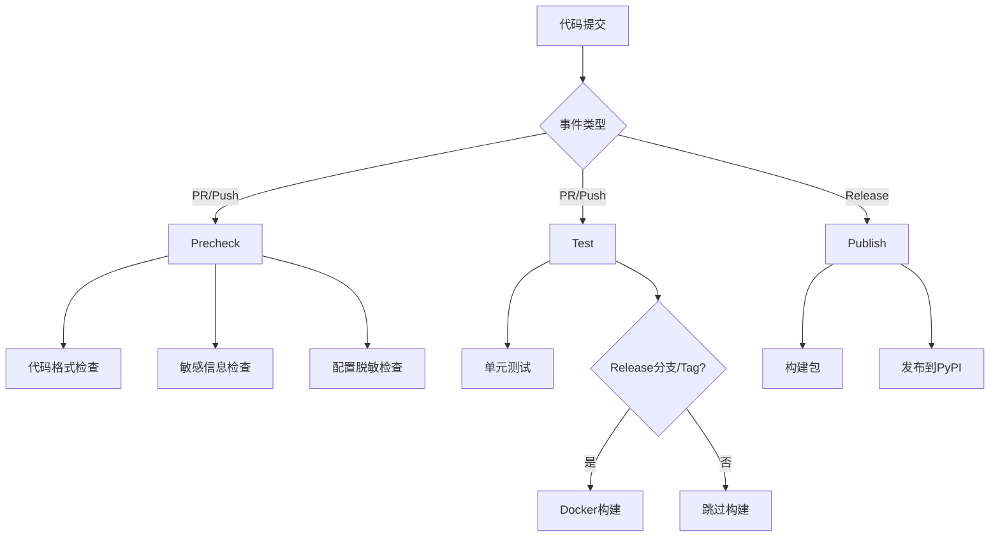

# GitHub Actions 工作流说明

## 🔄 CI Pipeline 架构

项目采用分离式CI架构，包含三个独立的工作流：

### 1. 预检查工作流 (precheck.yml)
- **触发条件**: PR创建/更新、Push到主要分支
- **功能**: 快速的代码质量和安全检查
- **包含内容**:
  - Python代码格式检查 (flake8, black, isort)
  - 语法检查
  - 配置文件脱敏检查
  - 敏感信息泄露检查

### 2. 测试与构建工作流 (test.yml)
- **触发条件**: PR创建/更新、Push到主要分支
- **功能**: 单元测试和镜像构建
- **包含内容**:
  - 多版本Python单元测试 (3.9, 3.12)
  - 测试覆盖率报告
  - Docker镜像构建 (仅在release分支或tag时)

### 3. 发布工作流 (publish.yml)
- **触发条件**: Release发布、手动触发
- **功能**: 包发布到PyPI

## 🚀 镜像构建策略

Docker镜像构建**仅在以下情况触发**：
- ✅ Push到 `release*` 分支
- ✅ Push tag (如 `v1.0.0`)
- ✅ 手动触发 workflow_dispatch

其他情况（如普通分支push、PR）**不会构建镜像**，提高CI效率。

### 镜像标签规则

**Tag推送**:
```
registry.cn-hangzhou.aliyuncs.com/vertex:v1.0.0
registry.cn-hangzhou.aliyuncs.com/vertex:latest
```

**Release分支**:
```
registry.cn-hangzhou.aliyuncs.com/vertex:release-main
registry.cn-hangzhou.aliyuncs.com/vertex:abc1234  # commit id
registry.cn-hangzhou.aliyuncs.com/vertex:latest   # 仅主release分支
```

## 📋 检查项目说明

### 预检查 (precheck.yml)

#### 1. 敏感信息检查
检查以下敏感信息模式：
- API Keys (`sk-xxx`, `sk-or-xxx` 格式)
- 密钥和令牌
- 密码
- 数据库连接字符串
- 邮箱密码组合

#### 2. Python代码格式检查
- **语法检查**: 确保Python代码没有语法错误
- **代码风格检查**: 使用flake8检查代码风格
- **Import排序检查**: 使用isort检查import语句排序
- **代码格式检查**: 使用black检查代码格式

#### 3. 配置文件脱敏检查
自动运行脱敏脚本，确保配置文件不包含敏感信息。

### 测试与构建 (test.yml)

#### 1. 单元测试
- 多Python版本矩阵测试 (3.9, 3.12)
- 自动发现并运行测试脚本 (`scripts/run_tests.sh`)
- 测试覆盖率报告上传到Codecov

#### 2. Docker构建
- 仅在release分支或tag时触发
- 自动生成合适的镜像标签
- 支持多种镜像仓库配置

## 🛠️ 本地开发建议

### 安装开发依赖
```bash
pip install flake8==7.2.0 black==25.1.0 isort==6.0.1 autopep8==2.3.2
pip install pytest pytest-cov pytest-asyncio
```

### 代码格式化
```bash
# 运行完整的预提交检查
bash scripts/precommit.sh

# 或者分别运行
black .
isort .
flake8 .
```

### 运行测试
```bash
# 使用测试脚本
bash scripts/run_tests.sh

# 或者直接运行pytest
pytest vertex_flow/tests/ -v --cov=vertex_flow
```

### 配置文件脱敏
```bash
python3 scripts/sanitize_config.py
```

## 🔧 配置文件说明

- `.flake8`: flake8代码风格检查配置
- `pyproject.toml`: black和isort格式化配置
- `scripts/precommit.sh`: 本地预提交检查脚本
- `scripts/run_tests.sh`: 测试执行脚本
- `scripts/sanitize_config.py`: 配置文件脱敏脚本

## 🚨 故障排除

### 预检查失败

**1. 敏感信息检查失败**:
```bash
# 检查并移除敏感信息
python3 scripts/sanitize_config.py
# 确保敏感文件在.gitignore中
```

**2. Python格式检查失败**:
```bash
# 自动修复大部分格式问题
bash scripts/precommit.sh
```

**3. 语法错误**:
```bash
# 检查Python语法
python -m py_compile your_file.py
```

### 测试失败

**1. 单元测试失败**:
```bash
# 本地运行测试查看详细错误
bash scripts/run_tests.sh
```

**2. 镜像构建失败**:
- 检查Dockerfile语法
- 确保所有依赖都在requirements.txt中
- 检查Docker registry凭据配置

### 发布失败

**1. PyPI发布失败**:
- 检查版本号是否已存在
- 确保PYPI_API_TOKEN正确配置
- 验证包构建是否成功

## 📊 CI/CD流程图



## 💡 最佳实践

1. **提交前检查**: 使用 `bash scripts/precommit.sh`
2. **测试先行**: 确保本地测试通过后再推送
3. **敏感信息**: 使用环境变量，不要硬编码密钥
4. **版本管理**: 使用语义化版本号
5. **镜像发布**: 只在release分支或tag时触发构建