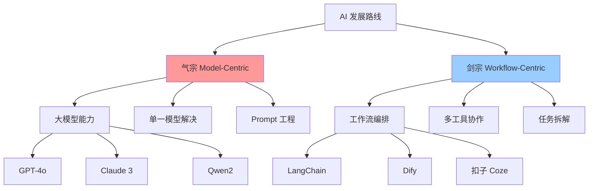
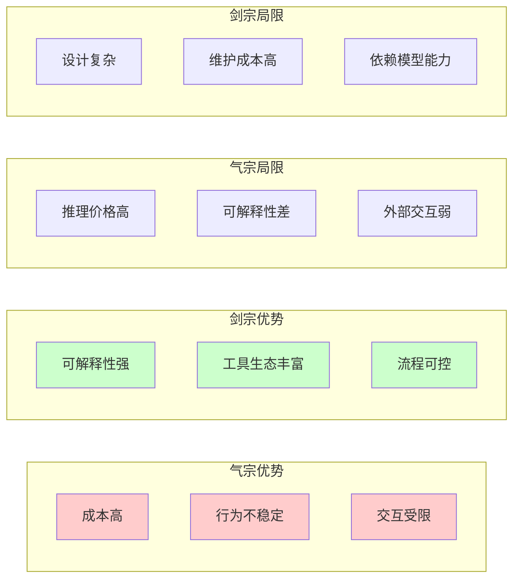
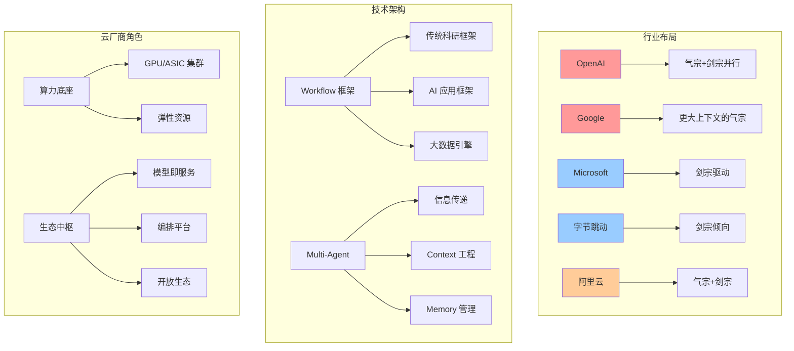
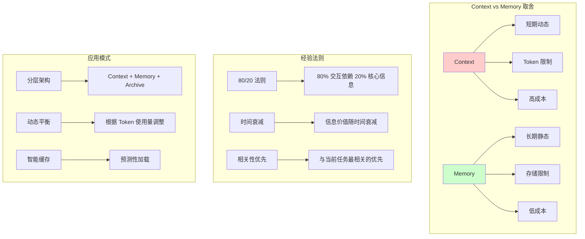
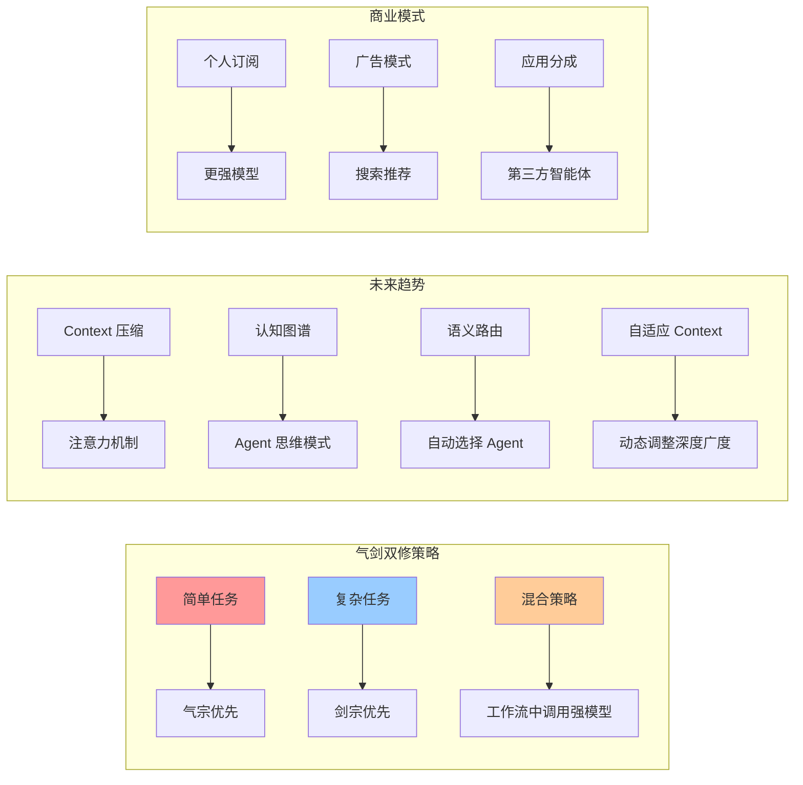
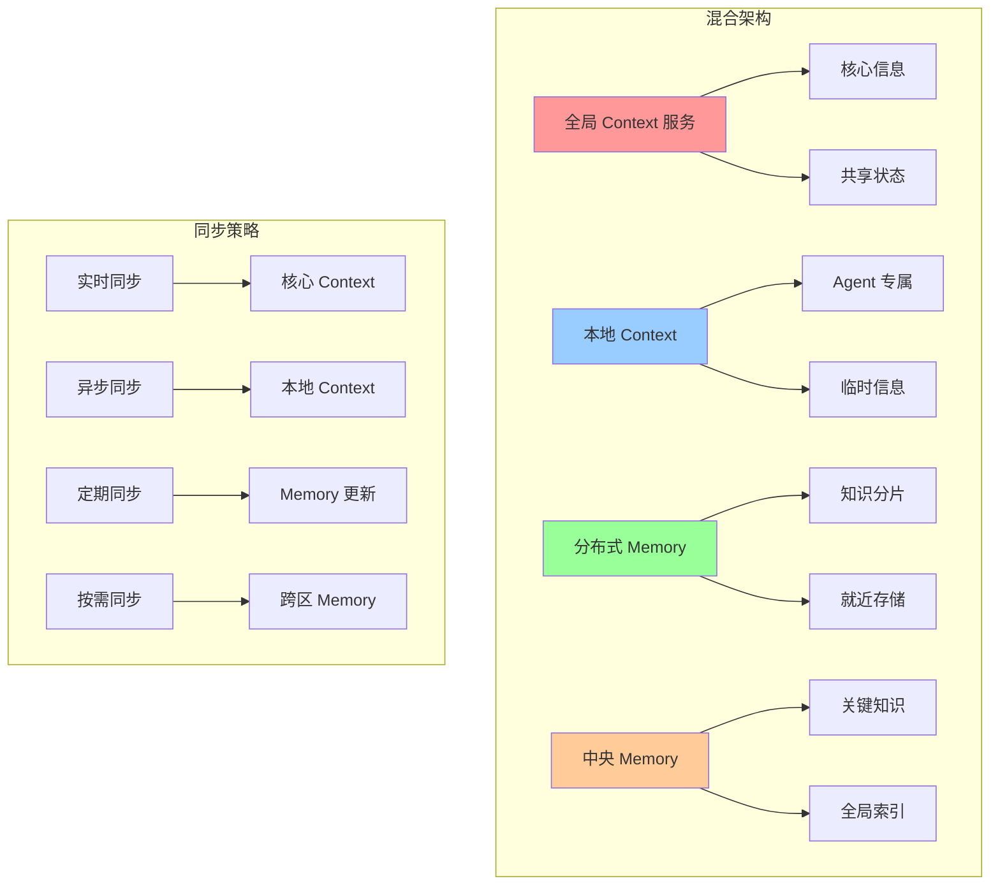

# Auto Agent：气宗还是剑宗？——Workflow 还是强大模型？

> 在 AI 的江湖里，**气宗**代表"模型至上"，**剑宗**则崇尚"流程为王"。面对飞速演进的大模型与百花齐放的工具链，我们真的只能二选一吗？

## 1. 引言：两条截然不同的道路

**气宗（Model-Centric）**：相信"大力出奇迹"，投入资源打造或调用更强大的 LLM，让单一模型尽可能解决所有任务。

**剑宗（Workflow-Centric）**：认为"巧劲胜蛮力"，通过工作流、外部工具与多模型协作，把复杂任务拆成若干简单步骤，各施所长。











这两条路线都已在实践中取得成功，也都暴露了局限。真正的挑战是：**时代在变，我们该怎样权衡？**

*回顾无 LLM 时代：*
在 2010~2020 年的深度学习黄金十年里，计算机视觉主要依赖 **CNN 卷积网络**（如 ResNet、EfficientNet）完成图像分类、目标检测、分割等任务；自然语言处理领域则以 **RNN/LSTM、Seq2Seq、Transformer-Encoder** 为主，分别用于情感分析、机器翻译、命名实体识别等。它们通常聚焦**单一功能**，需要通过流水线将多个专用模型串联（如 OCR + 关系抽取 + 规则引擎）才能完成复杂任务，这也催生了早期的**Pipeline/Workflow** 设计理念。LLM 的出现把多任务能力"折叠"到同一个参数空间中，大幅简化了模型数量，却把"提示工程"和"工具调用"推至前台——于是，新的编排问题再次浮现。

---

## 2. 气宗：模型能力的黄金时代

1. **大模型指数级提升**：从 GPT-3 到 GPT-4o，参数规模暴涨、推理链更长，零样本表现逼近人类。
2. **Agent 生态简化**：Prompt + 单模型即可完成翻译、写代码、写营销文案……
3. **使用门槛低**：一句自然语言即可运行，无需工程化。

> 局限：
> - 成本高（推理价格、显存消耗）    
> - 行为不稳定，可解释性差             
> - 与外界交互受限（文件系统、互联网、专用 API）

*进一步思考：*

当模型规模受限（如本地 7B/13B 参数小模型）或推理成本受限（边缘端部署、隐私环境）时，单纯依赖气宗会放大其推理、记忆和工具使用方面的短板。这时，通过**精心设计的流程编排**（剑宗思路）可以将"大任务"拆解为模型可承受的小步骤，并结合检索、脚本执行、规则引擎等外部能力弥补模型不足，实现"以弱胜强"。

---

## 3. 剑宗：工作流的组合艺术

1. **任务拆解**：把"大任务"切成可验证的小步骤，每步可由不同模型或工具执行。
2. **工具协同**：搜索引擎、数据库、正则解析器、脚本执行器……都是 Agent 的"招式"。
3. **管控与可解释**：每个节点可观测、可调参、可回滚，易于排查错误。

> 局限：
> - 设计复杂度高，初始开发时间长   
> - 需要维护工具链与运行时环境    
> - 对 Prompt 与模型能力仍有依赖

---

## 4. 时代变化带来的新挑战

| 维度 | 气宗（模型至上） | 剑宗（流程至上） |
|---|---|---|
| **推理能力** | 持续提升，但成本同样提升 | 可通过外部工具弥补模型短板 |
| **可解释性** | 黑盒，难追踪 | 白盒，每一步可观测 |
| **集成外部知识** | 依赖长上下文和检索插件 | 天生支持 RAG、API 调用 |
| **维护成本** | 升级模型即可 | 工具链升级、兼容性测试 |
| **创新速度** | 由模型供应商主导 | 由社区与开发者驱动 |

## 4.1 行业实践：巨头们的路线选择

| 公司 | 主推方向 | 典型做法 | 我们的观察 |
|------|---------|---------|-----------|
| **OpenAI** | 气宗+剑宗并行 | • 推出 GPT-4o 等超强模型  
• 发布 *Agents SDK* 与 *Swarm*，强调 **tool-calls + handoffs** 的多 Agent 协作 | 一边卷模型，一边给开发者"流程化"框架，是最典型的 **气剑双修** |
| **Google (DeepMind)** | 更大上下文的气宗 | • Gemini 1.5/2.5 最高 1M token 上下文  
• AI Studio 提供简单插件机制 | 靠"上下文洪荒之力"解决检索/记忆问题，但也在补齐工具生态 |
| **Microsoft** | 剑宗驱动 | • Copilot Studio 用"流程卡片"编排 Graph API、搜索、Teams  
• 大模型由 OpenAI 提供 | 聚焦 **企业工作流**，用 GPT-4 系列做"智力外包"，重点在**集成** |
| **DeepSeek (DeepSeek AI)** | 气宗为主 | • DeepSeek R/M 系列主打推理链<br>• R1 模型内置 "Reasoning" 输出 | 专注**长链推理**，力图打造"最会思考"的大模型 |
| **Alibaba (Tongyi Qwen)** | 气宗+剑宗 | • Qwen2 系列 + DashScope 函数调用/搜索插件<br>• 开源社区活跃 | **开源+企业插件**双轮驱动，工具生态扩张迅速 |
| **ByteDance (Doubao)** | 剑宗倾向 | • 豆包模型定位高性价比<br>• 深度融入 Feishu、抖音等业务流程 | 以**应用落地**为导向，用工作流推动模型普及 |
| **Anthropic** | 气宗为主 | • Claude 3 系列强调 "安全 + 长上下文 + 连贯推理"  
• 函数调用功能仍在灰度 | 先把"内功"练满，再慢慢引入工具 |
| **社区 (LangChain/LlamaIndex)** | 剑宗 | • 模块化链式调用、RAG 管线  
• 大量工具与向量数据库适配 | 给任何 LLM 插上"流程之剑"，生态极度活跃 |

> 可以看到：**没有哪家只走单一路线**。即使是最偏气宗的厂商，也在布局工具调用；而最重流程的框架，也依赖更强大的模型以减少链路复杂度。

## 4.2 云厂商与生态：底座与中枢的双重使命

当"气宗"卷模型、"剑宗"卷编排，公有云厂商必须同时扮演好**算力底座**与**生态中枢**两种角色，才能为上下游提供真正的气剑双修能力。

1. **算力与资源弹性**  
   - 海量 GPU／ASIC 集群，支持训练-推理一体化；裸金属、Serverless GPU、Token 计费推理端点多形态并存。  
   - 液冷、能效调度、绿色能源等技术，缓解"大模型＝大耗电"痛点。

2. **模型即服务（MaaS）**  
   - 模型托管、版本热更新、A/B 评估闭环，让企业把重心放在 Prompt 与业务逻辑。  
   - 开源、闭源、多尺寸（4B-70B）、多架构（Dense/MoE）模型一站集市；动态路由按任务特性自动选最优模型。

3. **Workflow / Agent 编排平台**  
   - 原生拖拽与 YAML/DSL 双模式；内置 LLM、RAG、向量检索、函数调用节点。  
   - 与 Flink、Spark、Ray 等流批引擎深度集成，支持 Token-Level Streaming 与批流一体迭代。

4. **数据、安全与合规**  
   - VPC 级私域训练与推理，端到端加密；零信任访问、细粒度权限与审计。  
   - TEE、联邦学习、跨境合规套件，满足金融、医疗、政企红线。

5. **开放生态与商业模式**  
   - SaaS／ISV 市场：让 Dify、扣子(Coze)、LangChain Flowise、魔搭社区 AgentFlow 等"一键上架"。  
   - Token＋算力＋软件订阅多元计费；与垂直行业伙伴共建"行业大模型＋Workflow"解决方案。

> **一句话**：云厂商要做到"硬件可随调、模型可选型、流程可编排、数据可托管、合规可背书、生态可共享"，才能在这场 AI 新武林中稳坐气剑双修的桥头堡。

## 4.3 多 Agent 协作：信息传递的江湖难题

当"剑宗"从单一工作流升级到多 Agent 协作时，**信息传递**成为新的技术瓶颈。就像武侠小说中"六脉神剑"需要内力相通，多个 Agent 之间的状态同步、消息路由、冲突解决也需要一套完整的"通信协议"。

### 4.3.1 信息传递的三大挑战

1. **状态一致性**  
   - 问题：Agent A 更新了用户偏好，Agent B 还在用旧数据做决策  
   - 现状：多数框架依赖数据库或消息队列，但缺乏"实时同步"机制  
   - 解决：分布式状态管理（如 Redis Cluster）、事件溯源（Event Sourcing）、CQRS 模式

2. **消息路由与优先级**  
   - 问题：用户同时触发"搜索"和"翻译"，哪个 Agent 先响应？  
   - 现状：简单轮询或固定优先级，缺乏动态调度  
   - 解决：智能路由（基于任务类型、Agent 负载、历史成功率）、优先级队列、负载均衡

3. **冲突检测与解决**  
   - 问题：Agent A 建议"重启服务"，Agent B 建议"扩容"，如何协调？  
   - 现状：多数靠人工干预或简单规则，缺乏自动冲突检测  
   - 解决：冲突检测算法、协商机制、仲裁 Agent、回滚策略

### 4.3.2 现有解决方案对比

| 方案 | 优势 | 局限 | 适用场景 |
|------|------|------|----------|
| **消息队列** (RabbitMQ/Kafka) | 解耦、可靠、高吞吐 | 缺乏语义理解，纯技术层面 | 大规模 Agent 集群 |
| **事件驱动** (Event Sourcing) | 完整历史、可回放、审计友好 | 存储开销大，查询复杂 | 金融、合规场景 |
| **共享状态** (Redis/etcd) | 实时性强、简单直接 | 单点故障、扩展性差 | 小规模协作 |
| **API 网关** (Kong/Envoy) | 统一入口、监控完善 | 增加延迟、复杂度高 | 微服务架构 |
| **专用协议** (gRPC/WebSocket) | 类型安全、双向通信 | 协议绑定、生态限制 | 同构 Agent 系统 |

### 4.3.3 行业实践与趋势

**OpenAI Swarm**：采用Handoff机制，Agent 间通过结构化消息传递上下文，但缺乏全局状态管理。

**LangChain Multi-Agent**：基于"Supervisor"模式，一个主 Agent 协调多个子 Agent，但容易成为瓶颈。

**Anthropic Claude Team**：通过"共享工作空间"概念，多个 Agent 在同一个对话上下文中协作，但扩展性有限。

### 4.3.4 未来发展方向

1. **语义路由**：基于任务语义而非简单关键词，自动选择最合适的 Agent 组合
2. **自适应协作**：Agent 根据历史协作效果，动态调整协作策略和通信频率  
3. **联邦学习思维**：借鉴联邦学习，在保护隐私前提下实现 Agent 间的知识共享
4. **区块链化**：利用区块链的不可篡改特性，确保 Agent 协作的透明性和可追溯性

### 4.3.5 Context 工程：多 Agent 协作的核心挑战

多 Agent 协作的本质不是简单的 **Prompt 优化**，而是复杂的 **Context 工程**。每个 Agent 都有自己的"认知边界"和"记忆容量"，如何让它们共享上下文、理解彼此、协调行动，是当前技术栈的空白地带。

#### Context 工程的三大维度

1. **上下文传递与压缩**  
   - 问题：Agent A 处理完 10 万字的文档，如何将关键信息传递给 Agent B？  
   - 现状：要么全量传递（Token 爆炸），要么简单摘要（信息丢失）  
   - 解决思路：
     - **分层 Context**：核心信息、背景信息、历史记录分层管理
     - **增量更新**：只传递变化的部分，而非全量同步
     - **语义压缩**：用向量表示、知识图谱等压缩长文本

2. **角色认知与边界管理**  
   - 问题：Agent A 是"数据分析师"，Agent B 是"产品经理"，如何让它们理解彼此的专业边界？  
   - 现状：多数框架用简单字符串描述角色，缺乏结构化认知  
   - 解决思路：
     - **角色图谱**：定义 Agent 的能力边界、专业领域、决策权限
     - **上下文继承**：子 Agent 继承父 Agent 的部分上下文，而非完全独立
     - **认知对齐**：通过"对齐对话"让 Agent 理解彼此的思维模式

3. **状态同步与一致性**  
   - 问题：Agent A 认为用户是"高级用户"，Agent B 认为用户是"新手"，如何统一认知？  
   - 现状：缺乏全局状态管理，Agent 间认知可能冲突  
   - 解决思路：
     - **共享工作空间**：类似 Google Docs 的实时协作模式
     - **版本控制**：Context 的变更历史、回滚机制
     - **冲突检测**：自动识别 Agent 间的认知冲突并协调

#### 现有技术栈的局限

| 技术方案 | 适用场景 | 对 Context 工程的支持 |
|----------|----------|----------------------|
| **LangChain Memory** | 单 Agent 记忆 | 缺乏多 Agent 间 Context 共享 |
| **Vector Database** | 知识检索 | 静态存储，缺乏动态 Context 管理 |
| **Event Sourcing** | 状态回放 | 事件粒度太细，缺乏语义聚合 |
| **GraphQL** | API 查询 | 数据层面，缺乏认知层面 Context |
| **WebSocket** | 实时通信 | 传输层面，缺乏 Context 语义 |

#### 行业探索与创新

**OpenAI Function Calling**：通过结构化函数定义 Agent 能力边界，但缺乏 Context 传递机制。

**Anthropic Claude Tool Use**：支持工具调用，但 Context 管理仍依赖外部系统。

**Vertex WhileVertexGroup**：支持循环和条件，但 Context 工程需要开发者手动设计。

**AutoGen**：提供多 Agent 对话框架，但 Context 压缩和角色管理仍需优化。

#### 未来发展方向

1. **Context 压缩算法**：借鉴 LLM 的注意力机制，设计专门的 Context 压缩和重构算法
2. **认知图谱**：构建 Agent 的"认知地图"，让它们理解彼此的思维模式和专业边界  
3. **自适应 Context**：根据任务复杂度动态调整 Context 的深度和广度
4. **Context 版本控制**：类似 Git 的 Context 分支、合并、冲突解决机制

> **一句话**：多 Agent 协作的难点不在于让每个 Agent 更聪明，而在于让它们"心有灵犀"。Context 工程就是让多个 Agent 共享同一个"大脑"，而不是简单的"多脑并行"。

### 4.3.6 Context vs Memory：经验与艺术的平衡

在多 Agent 协作中，**Context** 与 **Memory** 的取舍是一门经验学问，没有放之四海而皆准的公式。就像武侠中的"内力"与"招式"，Context 是当下的"气"，Memory 是积累的"功"，两者如何调配决定了 Agent 的"战斗力"。

#### Context 与 Memory 的本质区别

| 维度 | Context | Memory |
|------|---------|--------|
| **时效性** | 短期、动态、实时 | 长期、静态、持久 |
| **容量** | 有限（Token 限制） | 理论上无限（存储限制） |
| **访问速度** | 快速、直接 | 相对较慢（需要检索） |
| **更新频率** | 高频、实时 | 低频、批量 |
| **成本** | 高（每次推理都消耗） | 低（存储成本） |

#### 经验法则与取舍策略

1. **任务复杂度导向**  
   - **简单任务**：Context 为主，Memory 为辅  
     - 例：翻译一句话，主要依赖当前 Context
   - **复杂任务**：Memory 为主Context 为辅  
     - 例：长期项目规划，需要大量历史经验

2. **交互频率导向**  
   - **高频交互**：优先 Context，避免检索延迟  
     - 例：实时对话、快速问答
   - **低频交互**：优先 Memory，节省 Token 成本  
     - 例：定期报告、深度分析

3. **信息价值导向**  
   - **高价值信息**：放入 Context，确保实时可用  
     - 例：用户偏好、关键决策点
   - **低价值信息**：存入 Memory，按需检索  
     - 例：历史记录、背景资料

#### 实际应用中的经验模式

**模式一：分层架构**
```
Context（实时）：用户当前问题 + 最近 3 轮对话
Memory（短期）：最近 1 小时内的关键信息
Archive（长期）：历史数据、知识库
```

**模式二：动态平衡**
- 根据 Token 使用量动态调整 Context 与 Memory 比例
- 当 Context 接近上限时，将低频信息迁移到 Memory
- 当需要深度分析时，从 Memory 检索相关信息补充 Context

**模式三：智能缓存**
- 预测用户可能需要的下一轮信息，提前加载到 Context
- 基于用户行为模式，动态调整 Context 的"预热"策略

#### 分布式 vs 集中式管理

在多 Agent 协作中，Context 与 Memory 的管理模式直接影响系统的扩展性、一致性和性能。就像武林中的"分散修炼"与"集中传功"，两种模式各有优劣。

**集中式管理模式**

| 维度 | Context 集中式 | Memory 集中式 |
|------|----------------|---------------|
| **架构** | 中央 Context 服务 | 统一 Memory 存储 |
| **一致性** | 强一致性，实时同步 | 强一致性，全局可见 |
| **性能** | 低延迟，但单点瓶颈 | 快速检索，但存储压力大 |
| **扩展性** | 垂直扩展，容量有限 | 水平扩展困难 |
| **故障影响** | 单点故障影响全局 | 存储故障影响所有 Agent |
| **适用场景** | 小规模协作、实时性要求高 | 知识库、历史记录管理 |

**分布式管理模式**

| 维度 | Context 分布式 | Memory 分布式 |
|------|----------------|---------------|
| **架构** | 每个 Agent 独立 Context | 分片存储，就近访问 |
| **一致性** | 最终一致性，异步同步 | 分区一致性，局部优先 |
| **性能** | 本地访问快，但同步延迟 | 就近访问，但跨区延迟 |
| **扩展性** | 水平扩展，Agent 独立 | 水平扩展，按需扩容 |
| **故障影响** | 局部故障，影响有限 | 分区故障，部分可用 |
| **适用场景** | 大规模协作、高可用要求 | 海量数据、地理分布 |

**混合管理模式**



**实际应用中的选择策略**

1. **规模导向**
   - **小规模（<10 Agent）**：集中式管理，简化架构
   - **中规模（10-100 Agent）**：混合模式，核心集中+边缘分布
   - **大规模（>100 Agent）**：分布式管理，分区自治

2. **延迟导向**
   - **实时交互**：Context 本地化，Memory 就近存储
   - **批量处理**：Context 集中管理，Memory 分布式存储
   - **混合场景**：关键 Context 集中，非关键 Context 分布

3. **一致性导向**
   - **强一致性**：集中式管理，牺牲部分性能
   - **最终一致性**：分布式管理，容忍短暂不一致
   - **分区一致性**：混合模式，核心强一致，边缘弱一致

**行业实践对比**

| 厂商 | Context 管理 | Memory 管理 | 架构特点 |
|------|-------------|-------------|----------|
| **OpenAI Swarm** | 集中式 Handoff | 分布式 Agent 记忆 | 中央协调，边缘自治 |
| **LangChain** | 本地 Context | 分布式 Vector Store | 完全分布式，弱一致性 |
| **Anthropic Claude Team** | 共享工作空间 | 集中式知识库 | 强一致性，单点架构 |
| **Vertex Multi-Agent** | 混合模式 | 分层存储 | 核心集中，边缘分布 |

**未来发展趋势**

1. **自适应架构**：根据 Agent 数量、任务复杂度动态调整管理策略
2. **智能路由**：基于网络拓扑、负载情况自动选择最优存储位置
3. **边缘计算**：将 Context 和 Memory 下沉到边缘节点，减少延迟
4. **联邦学习思维**：借鉴联邦学习，在保护隐私前提下实现知识共享

> **一句话**：Context 和 Memory 的管理模式不是非此即彼的选择，而是需要根据规模、延迟、一致性要求动态调整的艺术。就像武林中的"内外兼修"，既要内力深厚（集中式），也要招式灵活（分布式）。

---

## 5. 取舍与融合：气剑双修

*编排的本质：*
无论时代采用 CNN、BERT 还是 GPT-4o，只要涉及 **多步骤、多工具、多需求**，就绕不开"把零散能力按业务目标串联"这一动作——这便是编排。它不是技术附属品，而是一种**方法论**：
1. 把业务流程显式化，便于协作、调试、度量。
2. 把模型调用视作实现细节，保持上层逻辑稳定。
3. 让工程师与模型的"接口"更清晰，降低更换模型带来的冲击。

从这个角度看，AGI 也可以被视作"人类应用逻辑"的延伸：当模型足够强大时，我们把更多流程下沉到模型内部；当模型仍有限时，我们在外层用编排去弥补。二者并非此消彼长，而是**在不同抽象层次互补**。

1. **简单任务 → 气宗优先**：撰写摘要、翻译、头脑风暴等，可直接调用强模型，开发速度最快。
2. **复杂任务 → 剑宗优先**：需要外部数据、流程可控时，使用工作流拆解任务。
3. **混合策略**：在工作流节点中调用强模型，让模型承担高智力子任务，同时保留流程可控性。

> 高性价比做法：**核心逻辑用工作流，知识与创意环节交给强模型**。

---

## 6. 两个极简示例

### 6.1 纯模型（气宗）
```bash
# 直接让大模型完成内容生成
vertex chat "用三句话介绍量子计算"
```

### 6.2 工作流（剑宗）
```bash
# 使用预设工作流 + 多工具完成市场调研
vertex workflow run deepresearch --topic "电动车市场"
```

*Vertex* 既内置多模型(`DeepSeek`, `Tongyi`, 本地 `Ollama`) ，又提供可视化工作流编辑器，天然支持"气剑双修"。

---

## 7. 现有 Workflow 框架速览 vs. Vertex 的差异化价值

> 工作流管理领域并不缺少"老牌选手"。在科研和数据工程圈子，**Luigi、Snakemake、Nextflow、Yadage、CWL、Reana** 等框架早已成名，并在 CERN 等机构广泛使用（详见 [Schmitt et al., 2024](https://export.arxiv.org/pdf/2212.01422v2.pdf)）。在 AI 圈，又有 **Airflow、Prefect、Dagster、LangChain Flowise** 等新星。那么，Vertex 为什么还有存在的必要？

### 7.1 科学计算 & 数据管道派
| 框架 | 设计初衷 | 优势 | 对 AI Agent 的短板 |
|------|----------|------|-------------------|
| Luigi | 批处理 ETL | Python 友好、依赖显式 | 不支持流式交互，无 LLM 概念 |
| Snakemake | 可重复科研 | 声明式 DAG、社区活跃 | 任务粒度粗，不懂函数调用 |
| Nextflow | 生信流水线 | 容器/云原生、扩展好 | 主要面向文件管线，实时性差 |
| CWL | 标准规范 | 跨语言兼容 | 语法复杂，上手门槛高 |
| Reana | CERN 平台 | 云端即开即用 | 偏 HPC，缺乏 AI 工具生态 |

> 结论：这些框架关注**批量文件处理、可复现科研**，而非实时、多模态、Tool-Calling 的 LLM 工作流。

*一些观察：*
- 传统科研框架的优势在于"可重复 + 文件 DAG"，非常适合离线分析，但缺乏对 **推理链、函数调用、流式 Token** 的原生支持。
- 如果任务以文本/向量为主、需要人机交互或实时反馈，则需要在这些工具之上再包一层 Agent Orchestrator，或直接使用 Vertex 等 LLM 原生框架。
- 对已有 Snakemake / Nextflow 资产的团队，**FunctionVertex** 可作为"桥接胶水"，把现有脚本包装成节点并与 LLM 交互。

### 7.2 AI 应用派
| 框架 | 定位 | 优势 | 局限 |
|------|------|------|------|
| Airflow/Prefect | 通用调度 | 任意任务编排 | 不内置 LLM 特性，需要手工集成 |
| LangChain Flowise | LLM 流水线 | 丰富组件、低代码 | 以 JS/TS 为主，Python 生态割裂；侧重链式调用，循环/复杂控制弱 |
| **Dify** | LLM 应用/Workflow 一体化平台 | 可视化 DAG、内置 RAG/Memory、插件市场、中文社区活跃 | 深度扩展依赖云端组件，自托管与细粒度权限控制仍在完善 |
| **扣子 (Coze)** | 智能体/Bot 工作流平台 | 可视化 DAG、插件体系、知识库一站集成，免费且支持多平台发布，中文社区活跃 | 深度扩展依赖字节生态，私有化与权限体系仍在加强，核心 SDK 未完全开源 |
| **魔搭社区 (ModelScope)** | 开源模型+AgentFlow | 海量模型仓库、AgentFlow 工作流、企业级算力与开源友好 | 侧重模型研发，对低代码编排支持有限；可视化和私有部署能力有待完善 |
| OpenAI Agents SDK/Swarm | 多 Agent 协作 | 官方支持、工具调用 | 偏向 GPT 生态，本地模型及中文化支持不足 |

### 7.3 Vertex 的独特价值
1. **LLM 原生**：提供 `LLMVertex / FunctionVertex / WhileVertexGroup` 等节点，天然兼容 OpenAI、DeepSeek、通义千问、Ollama 等多源模型。
2. **工具调用与多模态**：内置 WebSearch、命令行、金融数据等 Function Tools，支持 Gemini 2.5 图片 + 文本输入。
3. **可视化 + While 循环**：工作流拖拽编辑器 + `WhileVertexGroup`，轻松实现迭代分析、RAG、Agent Feedback Loop。
4. **流式 Reasoning**：支持思考过程实时输出 (`chat_stream_with_reasoning`)，便于调试与可解释。
5. **本地优先**：对 Ollama 等本地模型友好，可离线运行，数据隐私安全。
6. **中文生态**：官方中文文档 + CLI/桌面端，贴合国内开发者习惯。
7. **混合范式**：同一工作流中既可"单模型暴力"也可"多工具拆解"，真正做到气剑双修。

> **一句话**：当你既想利用强大模型，又想保留流程可控性、工具生态和本地部署自由度时，Vertex 能提供"一站式气剑双修解决方案"。

### 7.4 大数据引擎视角：Spark/Flink 到 Ray 的 AI 工作流演进

| 引擎 | 初衷 | 典型场景 | 面向 AI Workflow 的变化 |
|------|------|----------|-------------------------|
| **Apache Spark** | 批量数据处理、SQL | ETL、数据仓库、MLlib 传统模型训练 | 推出 **Structured Streaming + ML Pipelines**，但对长链工具调用/推理流式交互仍需外部 Orchestrator；GPU 支持与深度学习集成（Spark + TorchDistributor）尚在加强 |
| **Apache Flink** | 实时流处理 | CEP、高吞吐事件流 | 引入 **Flink ML / Stateful Function**，适配异步推理服务；适合低延迟在线推理但缺乏高层 Agent 语义；Flink Forward 2025 已宣布在 roadmap 中加入 *LLM Agent* 支持 |
| **Ray** | 分布式 Python | RL、深度学习分布式训练 | **Ray Serve + Ray DAG** 面向"Pythonic AI Workflow"，支持模型部署、调度、Actor 细粒度并行，开始与 LLM Agent 结合（e.g. SkyPilot, Anyscale Endpoints） |

> 这些引擎关注 **高吞吐/低延迟 计算资源调度**，核心挑战在于把 AI 推理服务化、批流统一，而不是提供"思考—工具调用—循环改进"的 Agent 语义。

*整体观察：*
- 传统科研/ETL Workflow 注重文件产物与可复现性，缺乏 LLM 原生支持；
- AI 应用调度框架强调组件复用与开发效率，但在本地化、多循环控制上仍显不足；
- Spark/Flink/Ray 等大数据引擎解决算力与吞吐，需与上层语义编排解耦配合；
- Vertex 在语义层提供统一编排，可横向打通以上三类生态，兼顾本地部署与多模型集成。

### 数据仓库是"地基"，编排是"梁柱"
数据仓库（Snowflake、BigQuery、LakeHouse 等）提供**统一事实表与指标口径**，解决数据孤岛；而编排系统负责**把原始事件 → 清洗 → 特征 → AI 推理 → 结果回写**整链路打通，确保业务闭环。

在实际落地中：
1. **批流一体特征生成**：Flink/Spark 产出特征写入仓库，Vertex 上层编排再读取最新特征供小模型实时推理。
2. **指标回溯与 A/B 验证**：Workflow 每一步产生的中间表写入仓库，BI 工具直接可视化，业务方可追踪链路质量。
3. **逻辑与业务解耦**：当业务规则变化，仅需调整 Vertex 工作流的节点逻辑或 SQL 视图，底层仓库与算力层保持稳定。

一句话：**仓库固化数据资产，编排固化业务资产**；两者共同构成 AI 应用的"数智底座"。

---

## 8. 结语：选择不再二元，对话才是未来

- **不要迷信单一路线**：纯气宗可能因成本或数据孤岛而受限；纯剑宗可能被模型升级浪潮淘汰。   
- **以终为始，场景驱动**：先定义业务目标，再决定是"用力"还是"用巧"。   
- **拥抱混合范式**：在可解释与创造性之间找到平衡，让 Agent 既能舞剑，也能运气。

*回到第一性原理：*
> **简单即高效**。流程的存在是为了降低复杂度并提升可控性，但随着模型推理能力不断增强，部分流程有望被"折叠"进模型内部——就像编译器把高级语法编译成底层指令那样。届时，外层编排将趋于极简，仅保留安全、权限、约束等人类必须掌控的节点，把余下的"细枝末节"交由模型自主处理。这也是气剑双修未来可能的收敛形态：**流程在宏观上仍然存在，却在微观上被简化到看不见**。

> *在这场 AI 争霸的江湖里，你会选择修炼内功，还是苦练剑法？或许，真正的高手从不设限。*

---

**关注我们，获取更多 AI 技术深度分析** 